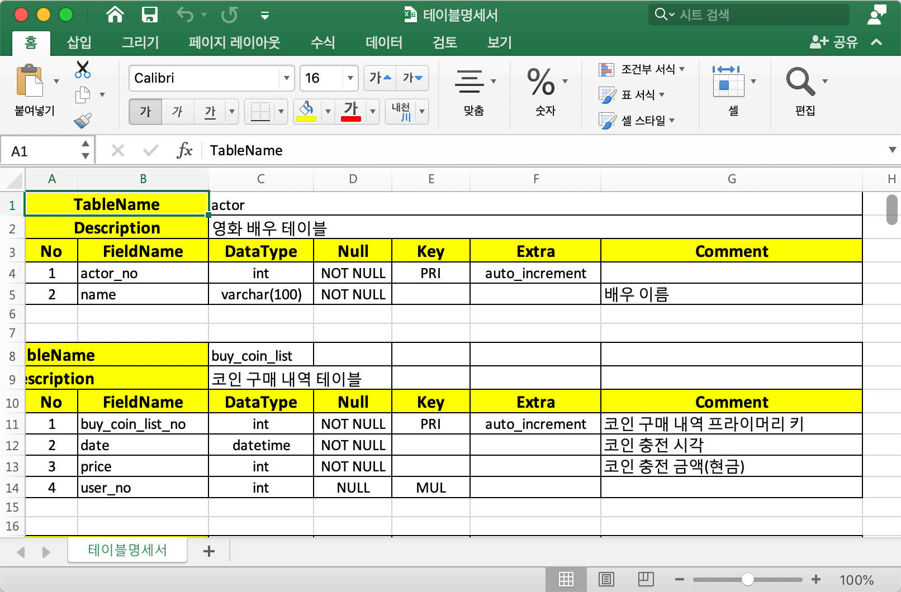

# MySQL 테이블 명세서 생성 프로그램
이 프로그램은 메가스터디IT아카데미(신촌)에서 이광호 강사가 진행하는 훈련과정에 참여하는 수강생의 포트폴리오 활동에 도움이 되고자 작성되었습니다. 
MySQL의 테이블 구조를 조회하여 엑셀로 명세서를 저장해주는 프로그램 입니다. 프로그램 UI는 구성하지 않았습니다.

- 저작도구: Eclipse
- 사용언어: JAVA

## 사용방법

이클립스에서 프로젝트를 import한 후, config.xml 파일의 데이터베이스 접속 정보를 수정하고 바로 실행하면 됩니다.

```xml
    <properties>
        <property name="hostname" value="localhost" />
        <property name="portnumber" value="3306" />
        <property name="database" value="데이터베이스이름" />
        <property name="username" value="사용자계정" />
        <property name="password" value="계정비밀번호" />
    </properties>
```

## 실행 결과 산출물 예시



## 사용된 라이브러리
- https://github.com/virtuald/curvesapi
- MySQL Connector java : https://dev.mysql.com/downloads/connector/j/3.0.html 
- MyBatis3 : http://www.mybatis.org/mybatis-3/ko/
- Apache Log4j2 : https://logging.apache.org/log4j/2.x/
- Apache POI Library : https://poi.apache.org/
- Apache XML Beans : https://xmlbeans.apache.org/
